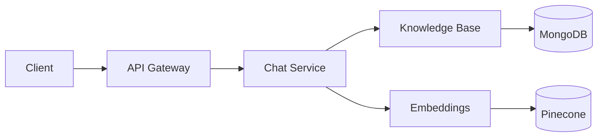

<link rel="stylesheet" href="/assets/style.css">


# Architecture

## High‑Level
- Client applications interact with the API gateway for routing and auth.
- Core services handle chat orchestration, knowledge base, and embeddings.
- Storage includes MongoDB for data and Pinecone for vector embeddings.
- Observability integrates metrics and dashboards.

## Data Flow
- Documents are ingested, chunked, and embedded.
- Vectors are stored and queried for semantic retrieval.
- Chat sessions fetch context and call LLMs via provider adapters.

## Deployment
- Containerized services with Kubernetes manifests for scaling.
- Environment configuration via `.env` and settings modules.

## Diagram

