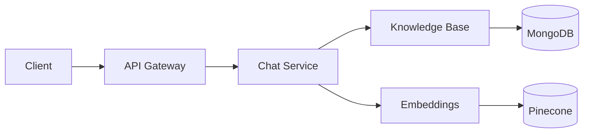
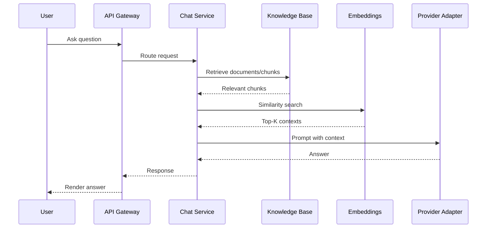

## Designs

### System Diagram

```mermaid
flowchart LR
  A[Client] --> B[API Gateway]
  B --> C[Chat Service]
  C --> D[Knowledge Base]
  C --> E[Embeddings]
  D --> F[(MongoDB)]
  E --> G[(Pinecone)]
```

### Sequence: Answer Question

```mermaid
sequenceDiagram
  participant U as User
  participant API as API Gateway
  participant C as Chat Service
  participant KB as Knowledge Base
  participant EMB as Embeddings
  participant LLM as Provider Adapter

  U->>API: Ask question
  API->>C: Route request
  C->>KB: Retrieve documents/chunks
  KB-->>C: Relevant chunks
  C->>EMB: Similarity search
  EMB-->>C: Top‑K contexts
  C->>LLM: Prompt with context
  LLM-->>C: Answer
  C-->>API: Response
  API-->>U: Render answer
```