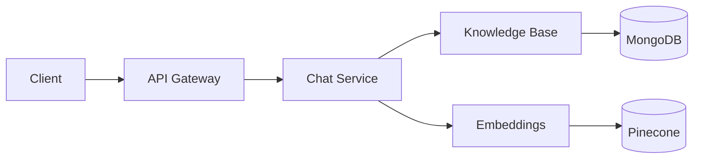

<link rel="stylesheet" href="/assets/style.css">
 
## Contents

{:toc}

## Overview

The AI Chatbot Support Service is an enterprise platform for customer support that integrates LLM providers (Azure OpenAI, AWS Bedrock), vector search, and a modular backend to deliver context‑aware chat and knowledge retrieval.

### Capabilities
- Conversational AI with context management
- Semantic knowledge search with embeddings
- Provider abstraction for multiple LLMs
- Observability and production‑grade deployment

### Components
- Chat orchestration and sessions
- Knowledge base ingestion and chunking
- Embedding generation and vector storage
- API layer and integrations

Maintained by bluntjoint — Rishabh A.

## Architecture

### High‑Level
- Client applications interact with the API gateway for routing and auth.
- Core services handle chat orchestration, knowledge base, and embeddings.
- Storage includes MongoDB for data and Pinecone for vector embeddings.
- Observability integrates metrics and dashboards.

### Data Flow
- Documents are ingested, chunked, and embedded.
- Vectors are stored and queried for semantic retrieval.
- Chat sessions fetch context and call LLMs via provider adapters.

### Deployment
- Containerized services with Kubernetes manifests for scaling.
- Environment configuration via `.env` and settings modules.



## Technical Implementation

### Services
- Chat service orchestrates conversations and state.
- Knowledge base service processes documents and indexing.
- Embeddings service generates and manages vectors.

### Integrations
- Provider adapters for Azure OpenAI and AWS Bedrock.
- External adapters (e.g., storage, analytics) via interfaces.

### APIs
- REST endpoints for sessions, chat, documents.
- Swagger docs available at `/api/docs/` when running locally.

### Observability
- Metrics and dashboards for performance and reliability.

## Schema

### Core Collections
- `users`: profiles, roles, and auth metadata.
- `sessions`: chat sessions with context and timestamps.
- `knowledge_base_documents`: source documents with metadata.
- `knowledge_base_chunks`: chunked content with embeddings and indexes.

### Embedding Metadata
- Model name, dimension, vector id.
- Generation timestamp and chunk context.

### Indexes
- Unique ids, compound indexes for fast retrieval.

## Usage

### Quick Start (Docker)
```bash
cp .env.example .env
docker-compose up -d
docker-compose exec chatbot-api python manage.py migrate
open http://localhost:8000
```

### Development (Local)
```bash
python -m venv venv
source venv/bin/activate
pip install -r requirements.txt
python manage.py migrate
python manage.py runserver
```

### API
Swagger docs: `http://localhost:8000/api/docs/`

<!-- Mermaid support for rendering diagrams -->
<script src="https://cdn.jsdelivr.net/npm/mermaid@10/dist/mermaid.min.js"></script>
<script>
  mermaid.initialize({ 
    startOnLoad: true, 
    theme: 'neutral',
    securityLevel: 'loose',
    flowchart: {
      useMaxWidth: true,
      htmlLabels: true,
      curve: 'basis'
    }
  });
  
  // Convert fenced code blocks with language-mermaid
  document.addEventListener('DOMContentLoaded', function () {
    document.querySelectorAll('pre > code.language-mermaid').forEach(function (code) {
      var pre = code.parentElement;
      var container = document.createElement('div');
      container.className = 'mermaid';
      container.textContent = code.textContent;
      pre.parentElement.replaceChild(container, pre);
    });
  });
  
  // Handle different markdown renderers
  document.addEventListener('DOMContentLoaded', function () {
    document.querySelectorAll('code.language-mermaid').forEach(function (code) {
      if (code.parentElement && code.parentElement.tagName.toLowerCase() !== 'pre') {
        var container = document.createElement('div');
        container.className = 'mermaid';
        container.textContent = code.textContent;
        code.parentElement.replaceChild(container, code);
      }
    });
  });
</script>
