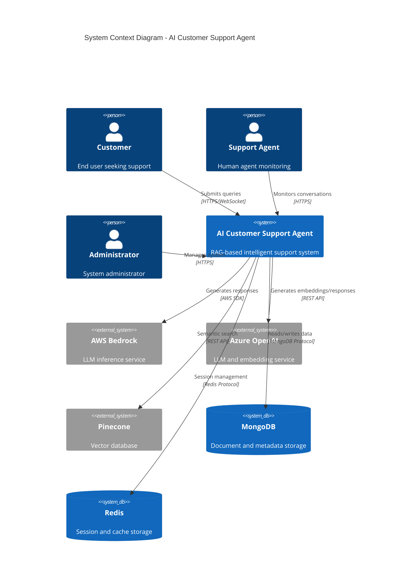
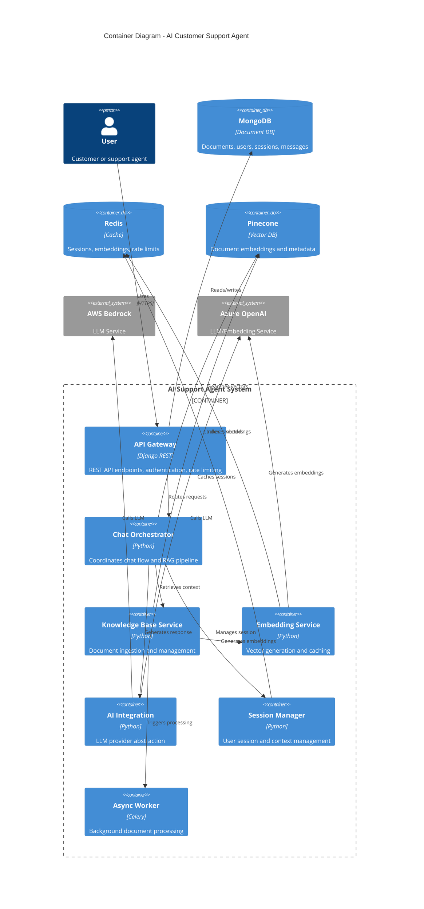
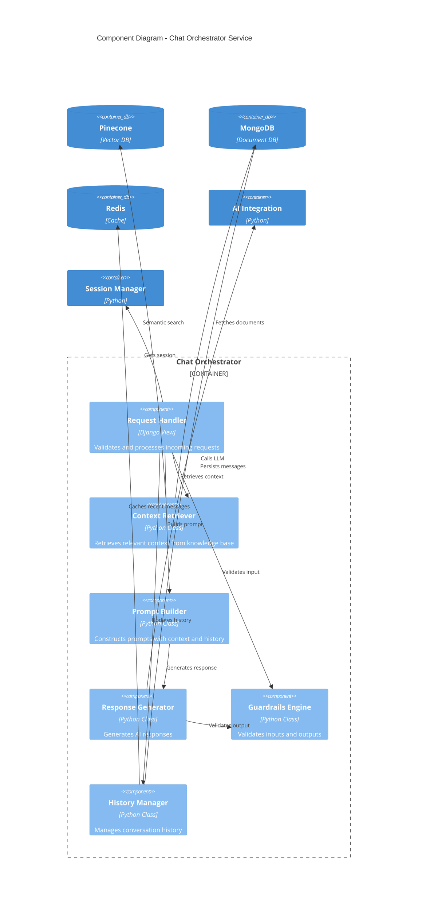
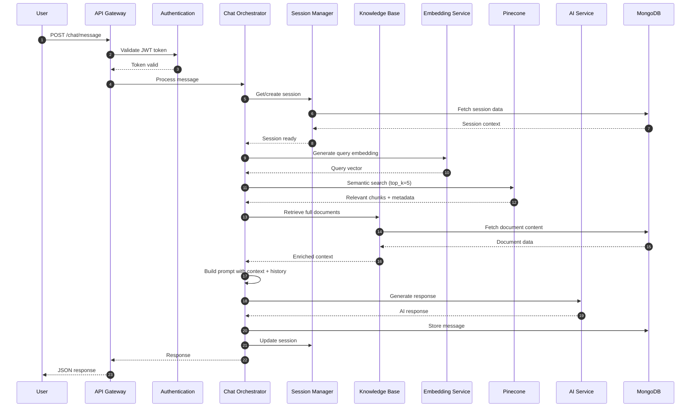
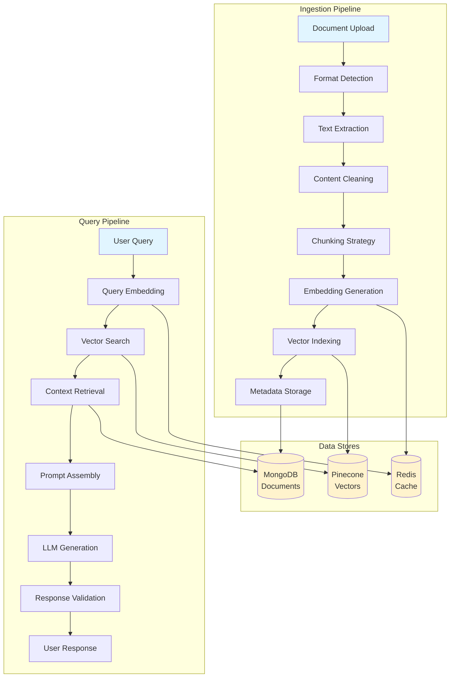
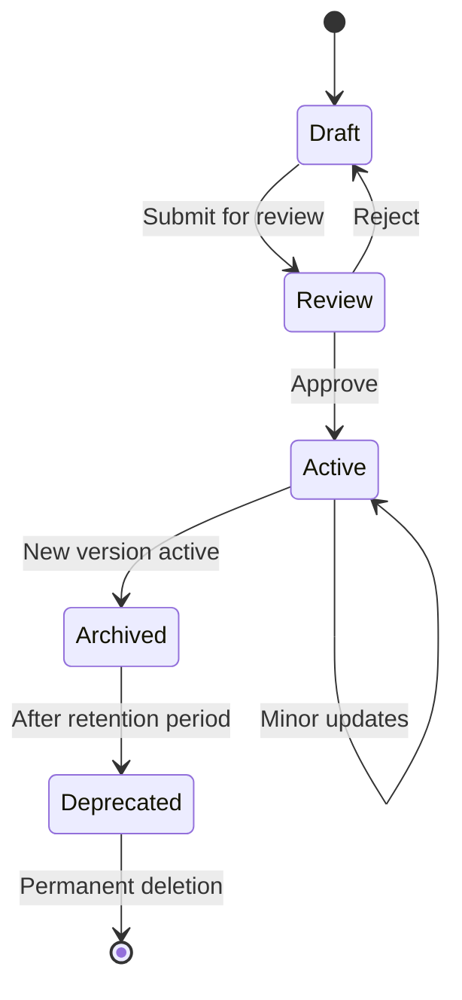
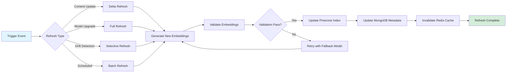
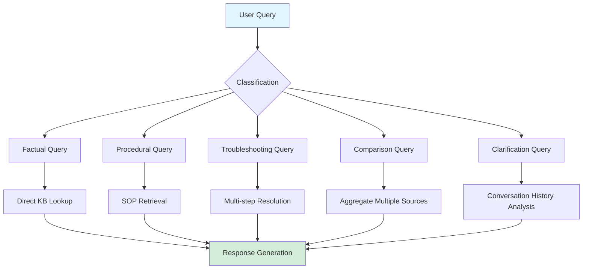
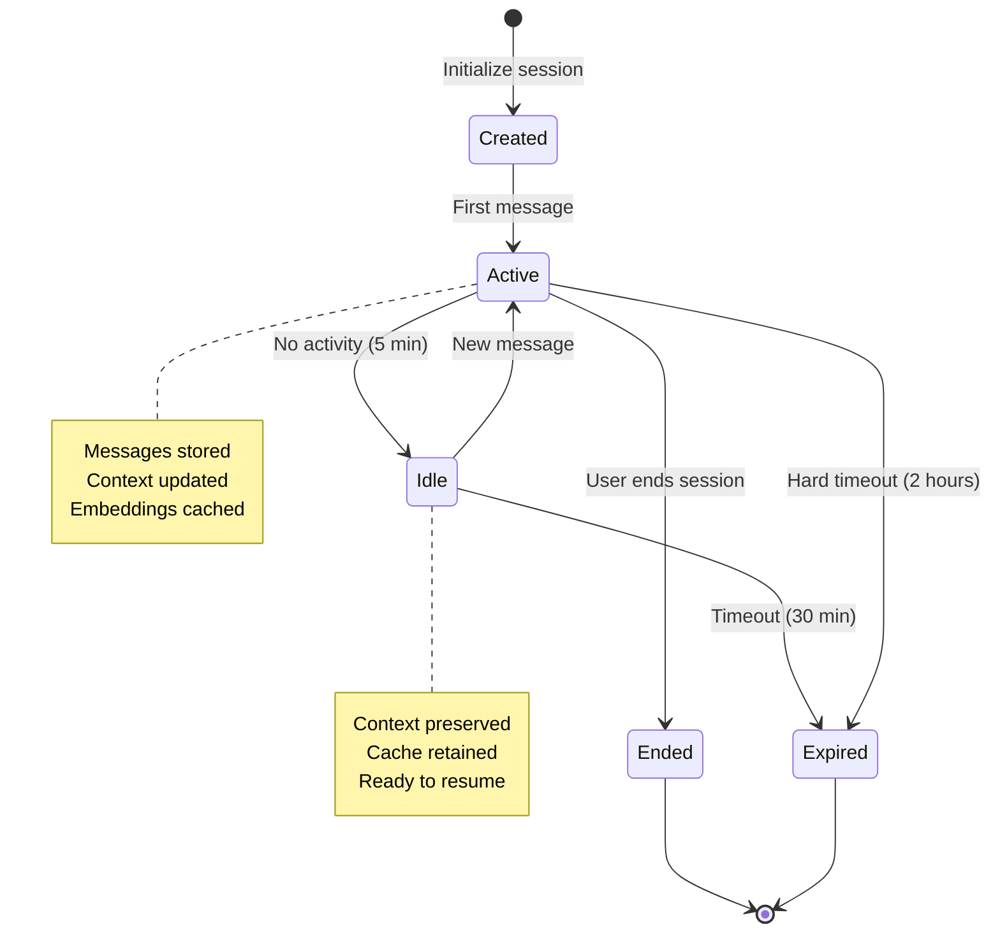
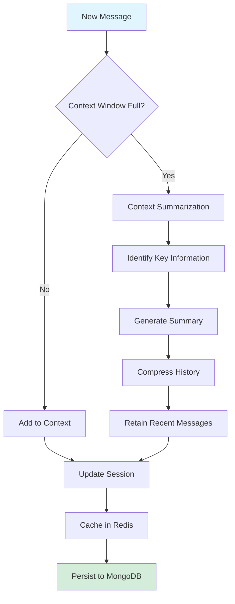

# AI Customer Support Agent
{: .fs-9 .fw-700 }

Technical Architecture & Implementation Guide
{: .fs-6 .fw-300 .text-grey-dk-000 }

---

## Table of Contents
{: .no_toc }

1. TOC
{:toc}

---

## Overview

This document provides comprehensive technical architecture and implementation details for an AI-powered customer support agent built on Retrieval-Augmented Generation (RAG) architecture. The system leverages vector databases, multiple LLM providers, and sophisticated knowledge base management to deliver accurate, contextual responses to customer queries.

### Technology Stack

| Component | Technology |
|:----------|:-----------|
| **Backend Framework** | Django 4.2 + Django REST Framework |
| **Primary Database** | MongoDB 6.0+ |
| **Vector Database** | Pinecone |
| **Cache Layer** | Redis 7.0+ |
| **LLM Providers** | AWS Bedrock, Azure OpenAI |
| **Embeddings** | HuggingFace Transformers, Azure OpenAI |
| **Orchestration** | Kubernetes (Azure AKS) |
| **Infrastructure** | Terraform (Azure) |
| **Monitoring** | Prometheus, Grafana |

---

## Architecture Overview

### C4 Model: System Context

The following diagram illustrates the system context showing how the AI Customer Support Agent interacts with users, external systems, and data sources.



### C4 Model: Container Diagram

The container diagram shows the high-level technology choices and how containers communicate.



### C4 Model: Component Diagram - Chat Orchestrator

The component diagram details the internal structure of the Chat Orchestrator container.



---

## System Architecture

### Request Flow



### Data Flow Architecture



---

## Knowledge Base Management

### Document Versioning

The system implements comprehensive versioning for knowledge base documents to track changes, enable rollback, and maintain audit trails.

**Version Control Schema:**

```javascript
{
  "doc_id": "doc_faq_001",
  "current_version": 3,
  "versions": [
    {
      "version": 3,
      "created_at": "2025-01-14T10:00:00Z",
      "created_by": "admin@example.com",
      "changes": "Updated password reset procedure",
      "content_hash": "sha256:a3f5d9...",
      "embedding_version": "v3_ada002",
      "chunk_count": 47,
      "status": "active"
    },
    {
      "version": 2,
      "created_at": "2025-01-10T08:00:00Z",
      "created_by": "admin@example.com",
      "changes": "Added new FAQ items",
      "content_hash": "sha256:b2e4c8...",
      "embedding_version": "v2_ada002",
      "chunk_count": 42,
      "status": "archived"
    }
  ],
  "metadata": {
    "category": "FAQ",
    "department": "support",
    "tags": ["authentication", "password"]
  }
}
```

**Versioning Strategy:**

1. **Semantic Versioning**: Major.Minor.Patch format
   - Major: Structural changes, complete rewrites
   - Minor: Content additions, significant updates
   - Patch: Typo fixes, minor corrections

2. **Change Detection**:
   - Content hash comparison (SHA-256)
   - Automatic version increment on changes
   - Diff tracking for audit trails

3. **Version Management**:
   - Active version: Currently used for retrieval
   - Draft version: Under review, not indexed
   - Archived versions: Retained for compliance (90 days)
   - Deprecated versions: Scheduled for deletion

**Version Lifecycle:**



### Embedding Refresh Strategy

Embeddings are regenerated based on multiple triggers to ensure accuracy and leverage improved models.

**Refresh Triggers:**

| Trigger | Frequency | Scope | Priority |
|:--------|:----------|:------|:---------|
| **Content Update** | Immediate | Modified documents only | High |
| **Model Upgrade** | On deployment | All documents | Critical |
| **Drift Detection** | Weekly | Low-performing chunks | Medium |
| **Scheduled Refresh** | Monthly | All documents | Low |
| **Manual Trigger** | On-demand | Selected documents | Variable |

**Refresh Process:**



**Embedding Metadata:**

```javascript
{
  "chunk_id": "chunk_faq_001_05",
  "embedding_metadata": {
    "model": "text-embedding-ada-002",
    "model_version": "v2",
    "dimension": 1536,
    "generated_at": "2025-01-14T10:05:00Z",
    "generation_duration_ms": 145,
    "content_version": 3,
    "refresh_count": 2,
    "last_refreshed": "2025-01-14T10:05:00Z",
    "next_refresh": "2025-02-14T10:05:00Z"
  },
  "quality_metrics": {
    "retrieval_accuracy": 0.94,
    "avg_similarity_score": 0.87,
    "usage_count": 1247
  }
}
```

**Refresh Scheduling:**

- **Immediate**: Content updates trigger immediate re-embedding
- **Hourly**: Batch process for accumulated content changes
- **Daily**: Drift detection scan for underperforming embeddings
- **Weekly**: Quality metrics analysis and selective refresh
- **Monthly**: Full corpus refresh with latest model

### Knowledge Base Structure

**Supported Content Types:**

1. **FAQs**: Question-answer pairs with metadata
2. **SOPs**: Step-by-step procedures with versioning
3. **Product Docs**: Technical documentation with hierarchical structure
4. **Troubleshooting Guides**: Problem-solution mappings
5. **Policy Documents**: Company policies with approval workflows

**Content Organization:**

```
knowledge_base/
├── faqs/
│   ├── authentication/
│   ├── billing/
│   └── technical/
├── sops/
│   ├── customer_service/
│   ├── technical_support/
│   └── escalation/
├── product_docs/
│   ├── api/
│   ├── user_guides/
│   └── admin_guides/
└── policies/
    ├── privacy/
    ├── security/
    └── compliance/
```

**Chunking Strategies:**

| Strategy | Use Case | Chunk Size | Overlap |
|:---------|:---------|:-----------|:--------|
| **Fixed Window** | Uniform documents | 512 tokens | 50 tokens |
| **Semantic** | FAQs, articles | 256-768 tokens | Dynamic |
| **Recursive** | Long documents | Parent: 2048, Child: 512 | 50 tokens |
| **Paragraph** | Structured content | Variable | None |

---

## User Query Patterns & Handling

### Query Classification

The system categorizes incoming queries to optimize retrieval and response generation.

**Query Types:**



**Query Processing Pipeline:**

1. **Intent Detection**: Classify query type using NLU
2. **Entity Extraction**: Identify key entities (product names, error codes)
3. **Context Enrichment**: Add session context and user profile
4. **Retrieval Strategy Selection**: Choose optimal search approach
5. **Response Generation**: Generate contextual response
6. **Quality Validation**: Ensure response meets quality criteria

### Query Execution Flows

**Flow 1: Simple Factual Query**

```
User: "What are your business hours?"
↓
1. Query Classification: Factual
2. Embedding Generation: Fast path (cached if recent)
3. Vector Search: top_k=3, threshold=0.75
4. Response: Direct answer from top result
5. Confidence: High (>0.9) → No LLM needed, template response
```

**Flow 2: Complex Procedural Query**

```
User: "How do I reset my password and update my email?"
↓
1. Query Classification: Multi-intent Procedural
2. Intent Decomposition: ["password_reset", "email_update"]
3. Parallel Retrieval: Fetch SOPs for both procedures
4. LLM Synthesis: Combine procedures into coherent steps
5. Response: Structured step-by-step guide
6. Follow-up: Offer additional help
```

**Flow 3: Troubleshooting Query**

```
User: "I'm getting error code E401 when logging in"
↓
1. Query Classification: Troubleshooting
2. Entity Extraction: error_code="E401", action="login"
3. Knowledge Base Search:
   - Error code lookup (exact match)
   - Similar error patterns (semantic search)
4. Context Analysis: Check user account status
5. Resolution Steps: Retrieve multi-step troubleshooting guide
6. Response: Diagnostic questions + potential solutions
7. Escalation: Flag for human agent if unresolved
```

### Response Quality Metrics

The system tracks response quality through multiple metrics:

**Relevance Metrics:**

```javascript
{
  "response_id": "resp_abc123",
  "metrics": {
    "retrieval_score": 0.92,        // Semantic similarity
    "context_coverage": 0.85,        // % of query addressed
    "source_diversity": 3,           // Number of sources used
    "confidence_score": 0.88,        // Overall confidence
    "fact_verification": "passed",   // Fact-checking status
    "citation_count": 2              // Number of KB references
  },
  "feedback": {
    "user_rating": 5,
    "resolution_achieved": true,
    "follow_up_needed": false
  }
}
```

---

## Session Management

### Session Lifecycle



**Session Data Structure:**

```javascript
{
  "session_id": "sess_xyz789",
  "user_id": "usr_abc123",
  "status": "active",
  "created_at": "2025-01-14T10:00:00Z",
  "last_activity": "2025-01-14T10:15:00Z",
  "expires_at": "2025-01-14T12:00:00Z",
  "context": {
    "conversation_summary": "User asking about password reset",
    "extracted_entities": {
      "user_email": "user@example.com",
      "issue_category": "authentication"
    },
    "intent_history": ["password_reset_request", "clarification"],
    "resolved_issues": [],
    "pending_actions": ["verify_email"]
  },
  "message_count": 5,
  "total_tokens": 2847,
  "avg_response_time_ms": 1850,
  "metadata": {
    "channel": "web",
    "user_agent": "Mozilla/5.0...",
    "ip_address": "192.168.1.1",
    "referrer": "https://example.com/help"
  }
}
```

### Context Window Management

**Context Retention Strategy:**



**Context Window Limits:**

| LLM Provider | Context Window | Reserved for Response | Available for Context |
|:-------------|:---------------|:----------------------|:----------------------|
| GPT-4 Turbo | 128,000 tokens | 4,000 tokens | 124,000 tokens |
| GPT-4 | 8,192 tokens | 2,000 tokens | 6,192 tokens |
| Claude 3 Sonnet | 200,000 tokens | 4,000 tokens | 196,000 tokens |
| Llama 2 70B | 4,096 tokens | 1,000 tokens | 3,096 tokens |

**Context Allocation:**

```
Total Context Window: 6,192 tokens (GPT-4 example)
├── System Prompt: 500 tokens
├── Retrieved Context: 3,000 tokens (5 chunks × 600 tokens)
├── Conversation History: 2,000 tokens (last 10 messages)
├── User Query: 192 tokens
└── Reserved for Response: 2,000 tokens
```

---

## Data Models

### MongoDB Collections

**1. Users Collection**

```javascript
{
  "_id": ObjectId("..."),
  "user_id": "usr_abc123",
  "email": "user@example.com",
  "role": "customer",
  "created_at": ISODate("2025-01-01"),
  "preferences": {
    "language": "en",
    "timezone": "America/New_York"
  }
}

// Indexes
db.users.createIndex({ "user_id": 1 }, { unique: true })
db.users.createIndex({ "email": 1 }, { unique: true })
```

**2. Chat Sessions Collection**

```javascript
{
  "_id": ObjectId("..."),
  "session_id": "sess_xyz789",
  "user_id": "usr_abc123",
  "status": "active",
  "context": { /* session context */ },
  "created_at": ISODate("2025-01-14"),
  "expires_at": ISODate("2025-01-14")
}

// Indexes
db.chat_sessions.createIndex({ "session_id": 1 }, { unique: true })
db.chat_sessions.createIndex({ "user_id": 1, "created_at": -1 })
db.chat_sessions.createIndex({ "expires_at": 1 }, { expireAfterSeconds: 0 })
```

**3. Chat Messages Collection**

```javascript
{
  "_id": ObjectId("..."),
  "message_id": "msg_def456",
  "session_id": "sess_xyz789",
  "role": "assistant",
  "content": "To reset your password...",
  "timestamp": ISODate("2025-01-14"),
  "sources": [
    {
      "doc_id": "doc_faq_001",
      "chunk_id": "chunk_faq_001_05",
      "score": 0.92
    }
  ],
  "metadata": {
    "model": "gpt-4",
    "tokens": 456,
    "duration_ms": 1850
  }
}

// Indexes
db.chat_messages.createIndex({ "session_id": 1, "timestamp": 1 })
db.chat_messages.createIndex({ "message_id": 1 })
```

**4. Knowledge Base Documents Collection**

```javascript
{
  "_id": ObjectId("..."),
  "doc_id": "doc_faq_001",
  "title": "Password Reset FAQ",
  "category": "authentication",
  "current_version": 3,
  "versions": [ /* version history */ ],
  "content": "Full document content...",
  "chunk_count": 47,
  "status": "indexed",
  "created_at": ISODate("2025-01-01"),
  "updated_at": ISODate("2025-01-14"),
  "indexed_at": ISODate("2025-01-14"),
  "metadata": {
    "author": "support_team",
    "tags": ["password", "authentication"],
    "department": "customer_service"
  }
}

// Indexes
db.knowledge_base_documents.createIndex({ "doc_id": 1 }, { unique: true })
db.knowledge_base_documents.createIndex({ "category": 1, "status": 1 })
db.knowledge_base_documents.createIndex({ "title": "text", "content": "text" })
```

**5. Knowledge Base Chunks Collection**

```javascript
{
  "_id": ObjectId("..."),
  "chunk_id": "chunk_faq_001_05",
  "doc_id": "doc_faq_001",
  "text": "Chunk content...",
  "position": 4,
  "tokens": 456,
  "embedding_id": "emb_chunk_faq_001_05",
  "embedding_metadata": {
    "model": "text-embedding-ada-002",
    "version": "v2",
    "generated_at": ISODate("2025-01-14"),
    "refresh_count": 2
  },
  "created_at": ISODate("2025-01-14")
}

// Indexes
db.knowledge_base_chunks.createIndex({ "chunk_id": 1 }, { unique: true })
db.knowledge_base_chunks.createIndex({ "doc_id": 1, "position": 1 })
```

### Pinecone Vector Index

**Index Configuration:**

```python
{
    "name": "chatbot-kb",
    "dimension": 1536,  # text-embedding-ada-002
    "metric": "cosine",
    "pods": 1,
    "pod_type": "p1.x1",
    "replicas": 2
}
```

**Vector Metadata:**

```javascript
{
  "chunk_id": "chunk_faq_001_05",
  "doc_id": "doc_faq_001",
  "title": "Password Reset FAQ",
  "category": "authentication",
  "doc_version": 3,
  "chunk_position": 4,
  "content_preview": "To reset your password, follow these steps...",
  "indexed_at": "2025-01-14T10:05:00Z",
  "embedding_model": "text-embedding-ada-002"
}
```

**Search Example:**

```python
query_vector = embed_service.generate("How do I reset my password?")

results = pinecone_index.query(
    vector=query_vector,
    top_k=5,
    include_metadata=True,
    filter={
        "category": "authentication",
        "doc_version": {"$gte": 2}
    }
)
```

### Redis Cache Strategy

**Cache Keys & TTL:**

```
session:{session_id}              TTL: 7200s (2 hours)
chat_history:{session_id}         TTL: 7200s (2 hours)
embedding:{model}:{hash}          TTL: 604800s (7 days)
document:{doc_id}                 TTL: 3600s (1 hour)
user_profile:{user_id}            TTL: 1800s (30 minutes)
rate_limit:{user_id}:{window}     TTL: 60s (1 minute)
```

---

## API Reference

### Chat Endpoints

**Initialize Session**

```http
POST /api/v1/chat/sessions/initialize
Content-Type: application/json
Authorization: Bearer {token}

{
  "user_id": "usr_abc123",
  "channel": "web"
}
```

Response:
```json
{
  "session_id": "sess_xyz789",
  "status": "active",
  "created_at": "2025-01-14T10:00:00Z",
  "expires_at": "2025-01-14T12:00:00Z"
}
```

**Send Message**

```http
POST /api/v1/chat/sessions/{session_id}/messages
Content-Type: application/json
Authorization: Bearer {token}

{
  "message": "How do I reset my password?",
  "context": {
    "user_email": "user@example.com"
  }
}
```

Response:
```json
{
  "message_id": "msg_def456",
  "role": "assistant",
  "content": "To reset your password, follow these steps:\n1. Go to...",
  "sources": [
    {
      "doc_id": "doc_faq_001",
      "title": "Password Reset FAQ",
      "score": 0.92
    }
  ],
  "metadata": {
    "processing_time_ms": 1850,
    "model": "gpt-4",
    "tokens_used": 456
  }
}
```

### Knowledge Base Endpoints

**Ingest Document**

```http
POST /api/v1/knowledge-base/documents/ingest
Content-Type: multipart/form-data
Authorization: Bearer {token}

file: <binary>
title: "New FAQ Document"
category: "technical"
```

Response:
```json
{
  "job_id": "job_ingestion_001",
  "status": "processing",
  "estimated_completion_seconds": 45
}
```

**Document Versioning**

```http
PUT /api/v1/knowledge-base/documents/{doc_id}/version
Content-Type: application/json
Authorization: Bearer {token}

{
  "content": "Updated content...",
  "changes": "Added new troubleshooting steps",
  "version_type": "minor"
}
```

Response:
```json
{
  "doc_id": "doc_faq_001",
  "new_version": 4,
  "previous_version": 3,
  "reindexing_job_id": "job_reindex_002",
  "status": "processing"
}
```

---

## Deployment

### Docker Compose

```yaml
version: '3.8'

services:
  api:
    build: .
    ports:
      - "8000:8000"
    environment:
      - MONGODB_URI=mongodb://mongodb:27017/chatbot
      - REDIS_URL=redis://redis:6379/0
      - PINECONE_API_KEY=${PINECONE_API_KEY}
      - AZURE_OPENAI_KEY=${AZURE_OPENAI_KEY}
    depends_on:
      - mongodb
      - redis

  celery:
    build: .
    command: celery -A chatbot worker -l info
    environment:
      - MONGODB_URI=mongodb://mongodb:27017/chatbot
      - REDIS_URL=redis://redis:6379/0
    depends_on:
      - mongodb
      - redis

  mongodb:
    image: mongo:6
    ports:
      - "27017:27017"
    volumes:
      - mongodb_data:/data/db

  redis:
    image: redis:7-alpine
    ports:
      - "6379:6379"
    volumes:
      - redis_data:/data

volumes:
  mongodb_data:
  redis_data:
```

### Kubernetes Deployment

```yaml
apiVersion: apps/v1
kind: Deployment
metadata:
  name: chatbot-api
spec:
  replicas: 3
  selector:
    matchLabels:
      app: chatbot-api
  template:
    metadata:
      labels:
        app: chatbot-api
    spec:
      containers:
      - name: api
        image: chatbot-api:latest
        ports:
        - containerPort: 8000
        env:
        - name: MONGODB_URI
          valueFrom:
            secretKeyRef:
              name: chatbot-secrets
              key: mongodb-uri
        - name: PINECONE_API_KEY
          valueFrom:
            secretKeyRef:
              name: chatbot-secrets
              key: pinecone-key
        resources:
          requests:
            memory: "1Gi"
            cpu: "500m"
          limits:
            memory: "2Gi"
            cpu: "1000m"
---
apiVersion: v1
kind: Service
metadata:
  name: chatbot-api
spec:
  type: LoadBalancer
  selector:
    app: chatbot-api
  ports:
  - port: 80
    targetPort: 8000
```

---

## Monitoring

### Key Metrics

```yaml
# Prometheus metrics
chatbot_requests_total{method, endpoint, status}
chatbot_request_duration_seconds{method, endpoint}
chatbot_llm_calls_total{provider, model}
chatbot_llm_tokens_total{provider, model, type}
chatbot_embeddings_generated_total{model}
chatbot_kb_searches_total
chatbot_kb_documents_total
chatbot_sessions_active
chatbot_cache_hits_total{cache_type}
chatbot_errors_total{type, severity}
```

### Health Checks

```http
GET /api/v1/health

{
  "status": "healthy",
  "checks": {
    "mongodb": "ok",
    "redis": "ok",
    "pinecone": "ok",
    "llm_provider": "ok"
  },
  "version": "1.0.0",
  "uptime_seconds": 86400
}
```

---

## Configuration

### Environment Variables

```bash
# Database
MONGODB_URI=mongodb://localhost:27017/chatbot
REDIS_URL=redis://localhost:6379/0

# Pinecone
PINECONE_API_KEY=your-api-key
PINECONE_ENVIRONMENT=us-west1-gcp
PINECONE_INDEX_NAME=chatbot-kb

# AI Providers
AZURE_OPENAI_KEY=your-key
AZURE_OPENAI_ENDPOINT=https://your-resource.openai.azure.com/
AWS_ACCESS_KEY_ID=your-access-key
AWS_SECRET_ACCESS_KEY=your-secret-key
AWS_REGION=us-east-1

# Application
DEFAULT_LLM_PROVIDER=azure
DEFAULT_EMBEDDING_MODEL=text-embedding-ada-002
MAX_TOKENS=2000
TEMPERATURE=0.7
TOP_K_RETRIEVAL=5
```

---

**Document Version**: 2.0.0
**Last Updated**: 2025-01-14
**Author**: Rishabh A.

<script src="https://cdn.jsdelivr.net/npm/mermaid/dist/mermaid.min.js"></script>
<script>
mermaid.initialize({
  startOnLoad: true,
  theme: 'default',
  securityLevel: 'loose'
});

// Click-to-enlarge functionality for Mermaid diagrams
document.addEventListener('DOMContentLoaded', function() {
  // Create modal container
  const modal = document.createElement('div');
  modal.className = 'mermaid-modal';
  modal.innerHTML = `
    <span class="close-button">&times;</span>
    <div class="mermaid-content"></div>
  `;
  document.body.appendChild(modal);

  const modalContent = modal.querySelector('.mermaid-content');
  const closeButton = modal.querySelector('.close-button');

  // Add click handlers to all mermaid diagrams
  function addClickHandlers() {
    const diagrams = document.querySelectorAll('.mermaid');
    diagrams.forEach(diagram => {
      // Skip if already has handler
      if (diagram.dataset.clickHandlerAdded) return;

      diagram.style.cursor = 'zoom-in';
      diagram.addEventListener('click', function(e) {
        // Clone the diagram
        const clone = this.cloneNode(true);
        clone.style.cursor = 'default';
        modalContent.innerHTML = '';
        modalContent.appendChild(clone);
        modal.classList.add('active');
        document.body.style.overflow = 'hidden';
      });

      diagram.dataset.clickHandlerAdded = 'true';
    });
  }

  // Close modal handlers
  closeButton.addEventListener('click', function() {
    modal.classList.remove('active');
    document.body.style.overflow = '';
  });

  modal.addEventListener('click', function(e) {
    if (e.target === modal) {
      modal.classList.remove('active');
      document.body.style.overflow = '';
    }
  });

  document.addEventListener('keydown', function(e) {
    if (e.key === 'Escape' && modal.classList.contains('active')) {
      modal.classList.remove('active');
      document.body.style.overflow = '';
    }
  });

  // Initialize click handlers after diagrams are rendered
  setTimeout(addClickHandlers, 1000);

  // Also check periodically in case diagrams render late
  const checkInterval = setInterval(function() {
    if (document.querySelectorAll('.mermaid svg').length > 0) {
      addClickHandlers();
      clearInterval(checkInterval);
    }
  }, 500);
});
</script>
